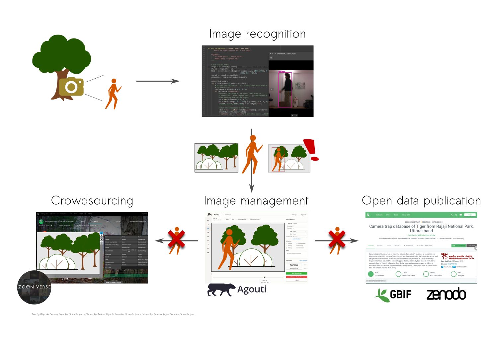
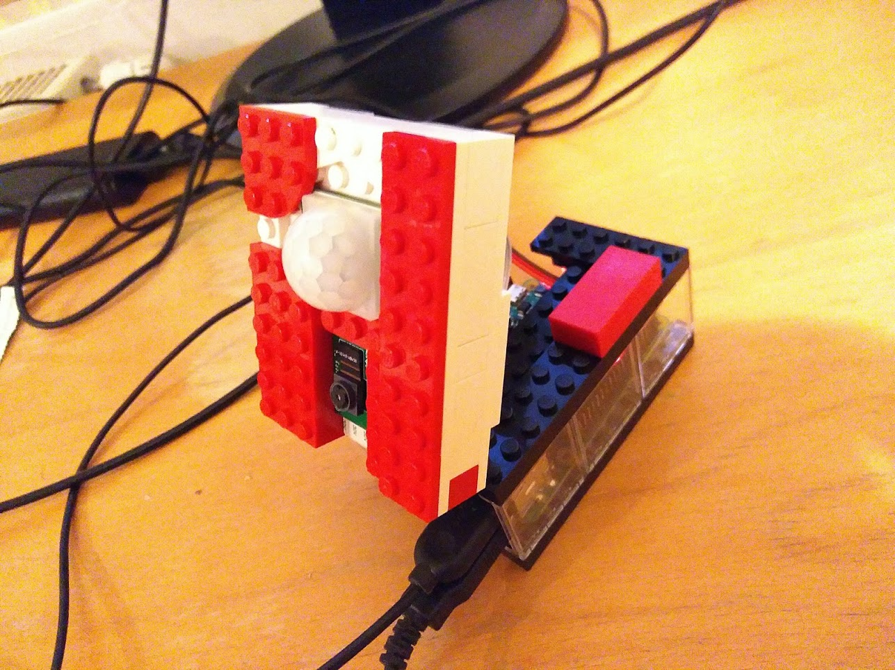
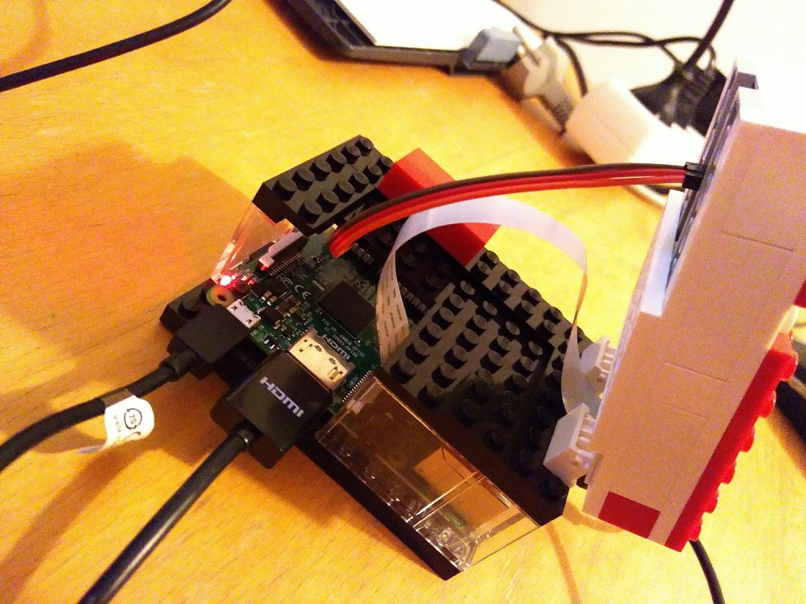
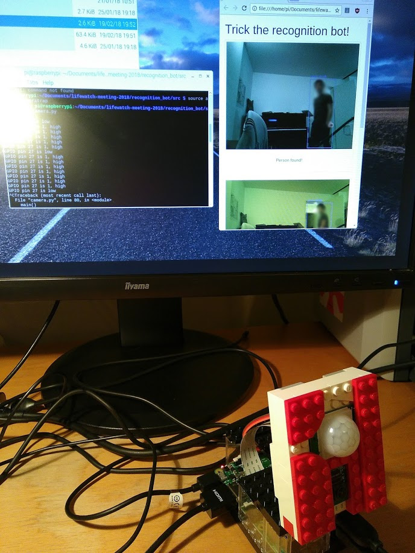

# Trick the recognition bot!

## Introduction

The demo "Trick the recognition bot" is a playful way to test a recognition bot similar to the one used in the cameratrap image processing project (CATREIN). 

Within the CATREIN project, we use camera traps to detect species. When the camera is triggered, images are taken. However, some of these images can contain humans. As we intend to use these images in further analysis, both by the researchers in the `image management` software [Agouti](http://cameratraplab.org/agouti), as well as for crowd-sourcing purposes (e.g. `Zooniverse`), we absolutely have to avoid to make these images containing humans to be publicly available. Furthermore, the data (i.e. images and annotations) created by [LifeWatchInbo](https://lifewatch.inbo.be/blog/) will be made publicly available as open data which should not contain images on humans.



Hence, whenever images are uploaded to the Image management system, an automatic detection of the humans on these images is implemented as an intermediate service. As such, these images can be properly handled to protect the privacy of the portrayed humans. 

To illustrated the technology (which is based on `convolutional neural networks`) to the user meeting audience, we prepared a DIY camera trap and recognition bot using a [raspberry Pi](https://www.raspberrypi.org/) and the [OpenCV](https://opencv.org/) library.  Triggered by a PIR sensor, the camera took images and the recognition algorithm was directly processing the incoming images and providing the result on a web page. 

We challenged the audience to trick our recognition bot by passing our DIY camera trap...

## Hardware



From the hardware side, the main components of our setup are:

- Raspberry Pi 3 (with 32 GB SD card)
- PIR sensor
- Raspberry Pi Camera module
- 3 Jumper cables (female-female)
- mouse, keyboard and screen (with HDMI connection)

There are plenty of tutorials and online resources to explain how to setup a Raspberry Pi with a PIR sensor and a camera, such as this [introductionary Raspberry Pi exmple](https://projects.raspberrypi.org/en/projects/parent-detector) or the material provided by [Naturebytes](http://naturebytes.org/). 

Just make sure to connect PIR correrctly with the Raspberry PI using the jumper cables. Remember which pin of the Raspberry you used for the OUT of the PIR sensor, as you need this in the script. We used pin 13, i.e. number 27 when using the Broadcom (BCM) pin numbering. 


## Software

As we were informed to not rely on the existing wifi connection and network possibilities in the venue were unknown to us, we decided to implement the entire pipeline on the raspberry Pi itself. 

The required packages are enlisted in the [environment.yml](./environment.yml) file, which can be used to create the required environment on the raspberry Pi. To have the conda environment available on the Raspberry Pi, install [berryconda](https://github.com/jjhelmus/berryconda) on the Raspberry Pi, a conda based Python distribution for the Raspberry Pi. To create the conda environment `cameratrap`, apply the following command:

```
conda env create -f environment.yml
```

The code was split into two main sections:

1. camera-handling (`camera.py`)
2. recognition bot (`recognition.py`)

For simplicity, a complete decoupling of both was done with the camera dumping images on disk and the bot reloading these images into memory for processing. 

### Camera handling

The implementation of the camera module imitates the behavior of a real cameratrap. 

When the PIR motion sensor is triggered, a sequence of images is taken (e.g. 2, 3...10) with a given frames per second rate (as fast as possible). When the sequence is taken, the status of the PIR sensor is directly checked and while motion is still detected, the camera takes a new sequence. This continuous until no motion is detected. 

This logic was implemented with the help of the [picamera](http://picamera.readthedocs.io/en/release-1.13/recipes1.html#capturing-consistent-images) package (`capture_sequence` command) and the [gpiozero](https://gpiozero.readthedocs.io/en/stable/api_input.html#motion-sensor-d-sun-pir) package, proividing high level functions for the PIR interaction. Remark that we used pin 27 (Broadcom (BCM) pin numbering) as defined in the script. 

### Recognition bot

For the recognition bot demo, a predefined model was used, available [here](https://github.com/C-Aniruddh/realtime_object_recognition), which can be directly interpreted by the `dnn` module of [openCV](https://opencv.org/). Basically, the bot comes down to a forward application of the model for each of the incoming images. 

For the website creation, a  [jinja2](http://jinja.pocoo.org/docs/2.10/) [template](./static/template.html) was set up, which is continuously updated for the incoming annotated images. 



## How to run the demo

To run the demo yourself, provide the following steps on the Raspberry Pi (either with `ssh` or just connect the Raspberry on a screen/keyboard/mouse):
1. Setup the Raspberry Pi with Berryconda, make sure the code is available on the Raspberrry Pi and create the `cameratrap` conda environment 

2. Create the folders `photos` and `ànnotated_photos` in the main recognition bot folder. 

3. In a terminal window, activate the conda `cameratrap` environment (`source activate cameratrap`)

4. Run the `camera.py` code to start the cameratrap (in the same terminal): `python ./src/camera.py`. The camera is now active and images will come in when movement is detected.

5. To start the processing of the images, open a new terminal window (or stop the camera first, as you like), activate the conda environment (`source activate cameratrap`) and run the `recognition.py` script: `python ./src/recognition.py`

6. Open the `index.html` and see the output of the recognition bot in the browser!

Was anyone able to trick the bot?

